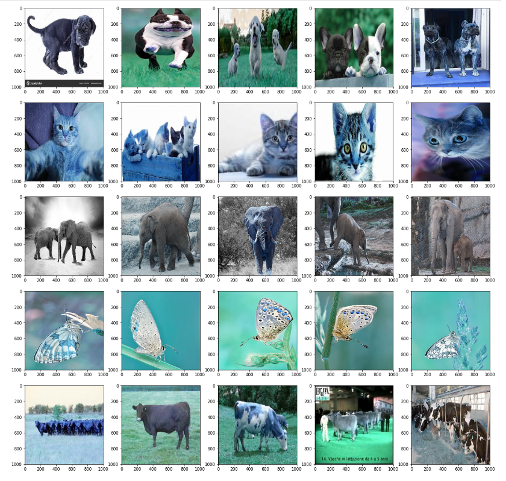

# Computer-vision-for-multi-class-image-classification.

```
 IDE: Jupyter Notebook 
 Language: Python 3 
 Libraries: - Open CV 4.1.1
            - Tensorflow 1.10
            - Keras 2.1.6
 
```

### Overview
The Raw image data which represents the real world image data has been downloaded from the kaggle, which contains the images of 5 different class of animals and their corresponsing labels. The main objective of this project is to implement the supervised learning algorithm to initially train the model with the convolution neural network. After training the neural network, it is able to identify the class of the animals on the un-trained images with an accuracy of 70%.


### Sample images used for training the model


